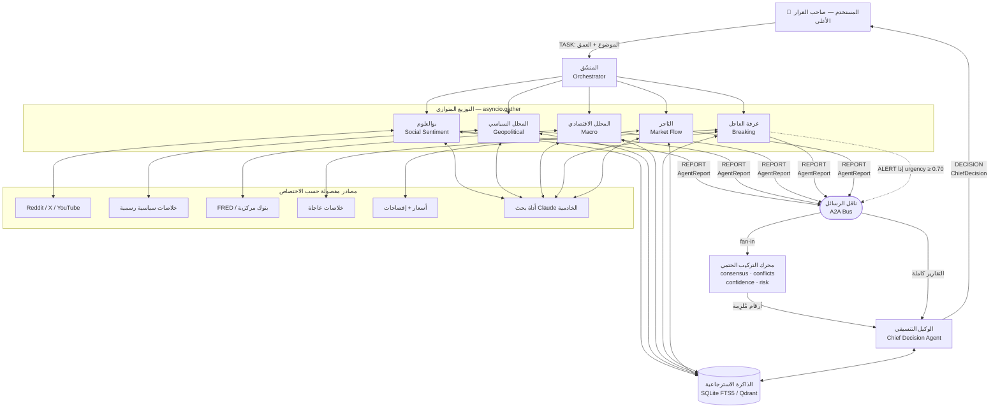
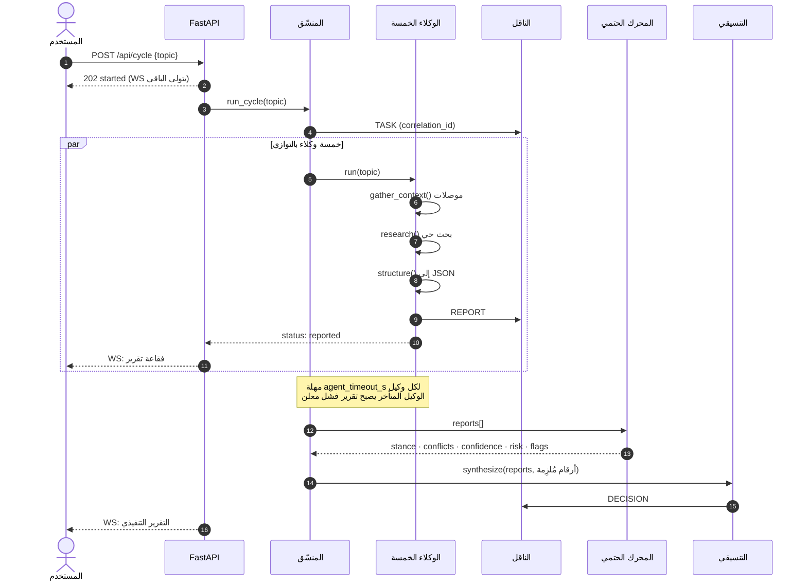
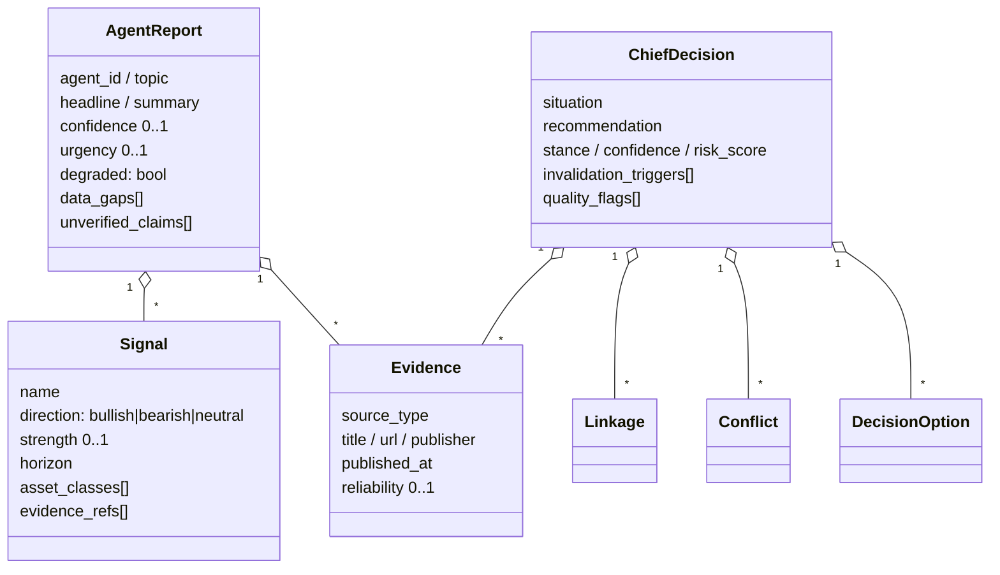

# ١. معمارية النظام وتدفق البيانات

> المستند الأول من ثلاثة: **تدفق البيانات والتواصل بين الوكلاء**.
> المستند الثاني: [برومبتات النظام](02-agents-prompts.md).
> المستند الثالث: [التقنيات ومصادر البيانات](03-tech-stack.md).

---

## ١.١ المبدأ الحاكم

المستخدم هو صاحب القرار الأعلى. الوكلاء لا يقررون نيابة عنه، بل يرفعون
إليه قراراً مُسنداً بالأدلة مع ثقته ومخاطره وشروط إبطاله.

ثلاث قواعد بنيوية تُنفَّذ في الكود لا في النصائح:

| القاعدة | أين تُفرض في الكود |
|---|---|
| المتخصص يرصد، والتنسيقي وحده يقرر | `prompts.py` (منع صريح) + عدم وجود حقل توصية في `AgentReport` |
| لا ادعاء بلا دليل | `AgentReport.evidence` + تنظيف `evidence_refs` المخترعة في `agents/base.py` |
| الأرقام الحاسمة تُحسب لا تُكتب | `synthesis.py` — دوال صرفة تتغلب على مخرج النموذج في `agents/chief.py` |

---

## ١.٢ الطبقات

```
┌──────────────────────────────────────────────────────────────┐
│  واجهة الدردشة (HTML/CSS/JS)  ← WebSocket + REST             │
├──────────────────────────────────────────────────────────────┤
│  FastAPI  (main.py)      REST + WS + بث الحالة               │
├──────────────────────────────────────────────────────────────┤
│  المنسّق (orchestrator.py)     توزيع والتقاء وحدود زمنية      │
├───────────────┬──────────────────────────────┬───────────────┤
│  الوكلاء      │  محرك التركيب الحتمي          │  ناقل الرسائل │
│ (agents/*)    │  (synthesis.py)              │  (bus.py)     │
├───────────────┼──────────────────────────────┼───────────────┤
│  طبقة النموذج │  موصلات البيانات              │  الذاكرة      │
│  (llm.py)     │  (tools/*)                   │  (memory.py)  │
└───────────────┴──────────────────────────────┴───────────────┘
```

---

## ١.٣ مخطط تدفق الدورة الكاملة



**لماذا يمرّ التركيب على محرك حتمي قبل النموذج؟**
لأن الثقة ودرجة المخاطرة أرقام يُبنى عليها مال. لو تركناها للنموذج
لتغيّرت بين تشغيلين متطابقين. الآن تُحسب في `synthesis.py` بقواعد
مكتوبة، ويكتب النموذج التحليل *ضمنها*، ثم تُفرض عليه في `chief.py`
(`decision.confidence = confidence` بعد المسودة لا قبلها).

---

## ١.٤ التسلسل الزمني للرسائل



---

## ١.٥ بروتوكول التواصل بين الوكلاء (A2A)

كل رسالة على الناقل مغلّف `Envelope` موحّد (`backend/schemas.py`):

```jsonc
{
  "message_id":     "msg_a1b2c3",
  "correlation_id": "cyc_9f8e7d",   // يربط كل رسائل الدورة الواحدة
  "ts":             "2026-09-15T11:00:00+00:00",
  "sender":         "the_trader",
  "recipients":     ["chief"],       // فارغة = بث عام
  "type":           "report",        // task|report|clarify|alert|decision|chat|status
  "topic":          "الذهب",
  "payload":        { /* AgentReport | ChiefDecision | ... */ },
  "trace":          ["6 أدلة", "3 إشارات", "ثقة 0.71"]
}
```

### أنواع الرسائل وقواعد توجيهها

| النوع | المسار | الدلالة |
|---|---|---|
| `task` | مستخدم/منسّق → وكلاء | تكليف بدورة تحليل |
| `report` | متخصص → التنسيقي **فقط** | تقرير معياري مُسند |
| `alert` | غرفة العاجل → **بث عام** | حدث تجاوز `urgency ≥ 0.70` |
| `clarify` | التنسيقي → متخصص | طلب استيضاح عند تضارب |
| `decision` | التنسيقي → المستخدم | التقرير التنفيذي |
| `status` | أي وكيل → الواجهة | مؤشر «يبحث الآن / يكتب» |

**قيد مقصود:** المتخصصون لا يتراسلون فيما بينهم. لو سُمح بذلك لتسرّبت
قراءة وكيل إلى وكيل آخر وفسدت استقلالية التقارير، وانهار معها معنى
«التأكيد المستقل» الذي يرفع الثقة في `synthesis.aggregate_confidence`.
الاستثناء الوحيد هو تنبيه `alert` العاجل، لأن تأخيره أخطر من تلويثه.

### سجل التدقيق

كل رسالة تُحفظ في `MessageBus._audit`، ويُستخرج أثر أي قرار كاملاً عبر:

```
GET /api/trace/{correlation_id}
```

فيظهر: من طلب، ومن ردّ، وبأي أدلة، وبأي ثقة، وفي أي لحظة.

---

## ١.٦ عقود البيانات



**الحقول الثلاثة التي لا يجوز حذفها من `AgentReport`:**
`data_gaps` و`unverified_claims` و`degraded`. هي التي تجعل عمى الوكيل
مرئياً للمستخدم بدل أن يُخفى خلف صياغة واثقة.

---

## ١.٧ محرك التركيب الحتمي

الكود في `backend/synthesis.py` والاختبارات في `tests/test_synthesis.py`.

### أوزان التصويت على الاتجاه

| الوكيل | الوزن | المبرر |
|---|---|---|
| التاجر | 1.00 | التدفق الفعلي أصدق من الكلام عنه |
| المحلل الاقتصادي | 0.95 | بيانات رسمية قابلة للتحقق |
| المحلل السياسي | 0.80 | حدث مؤكد، لكن أثره غير مباشر |
| غرفة العاجل | 0.75 | سريع ومؤثر، لكنه أولي وقابل للخطأ |
| بوالعلوم | 0.45 | أكثر المصادر إنتاجاً للإشارات الكاذبة |

`وزن الإشارة = وزن الوكيل × ثقة الوكيل × قوة الإشارة`

### حساب الثقة — لا متوسطات

```
ابدأ من  أضعف حلقة  = min(ثقة كل الوكلاء)
  + 0.10 لكل وكيل مؤكِّد مستقل      (بحد أقصى +0.20، بشرط اتفاق ≥ 70%)
  + تقاطع المصادر × 0.15             (بحد أقصى +0.10)
  − مجموع شدة التضارب × 0.08         (بحد أقصى −0.25)
  − عدد فجوات البيانات × 0.02        (بحد أقصى −0.12)
  − عدد الادعاءات غير المؤكدة × 0.015 (بحد أقصى −0.08)
  ⇒ سقف 0.60 إذا كان أي وكيل degraded
  ⇒ سقف 0.10 إذا لم يُركَّب القرار عبر النموذج أصلاً
  ⇒ محصور بين 0.05 و 0.95
```

**لماذا أضعف حلقة لا المتوسط؟** لأن المتوسط يخفي الوكيل الأعمى خلف
الوكلاء المبصرين. أربعة وكلاء بثقة 0.9 وواحد بثقة 0.1 ليست حالة
«ثقة 0.74»، بل حالة ثغرة واحدة كافية لإسقاط القرار.

كل تعديل يُسجَّل بنصه في `quality_flags` ويظهر للمستخدم:

```
سلسلة حساب الثقة: البداية من أضعف حلقة: 0.41 ← تقاطع مصادر بنسبة 100%: +0.10
← 2 تضارب غير محسوم: -0.07 ← 4 فجوة بيانات معلنة: -0.08 ← الثقة النهائية: 0.35
```

### كشف التضارب

إشارتان من **وكيلين مختلفين**، على **نفس فئة الأصول**، باتجاهين
متعاكسين، وقوة كل منهما ≥ 0.40.
`الشدة = (قوة₁×ثقة₁ + قوة₂×ثقة₂) ÷ 2`

التضارب المكتشف آلياً **يبقى في التقرير النهائي حتى لو تجاهله النموذج**
(`ChiefAgent._merge_conflicts`). إخفاء التضارب ممنوع بنيوياً، لا بالتعليمات.

### درجة المخاطرة

```
risk = 0.32 × أعلى إلحاح
     + 0.26 × حمل التضارب
     + 0.27 × نسبة الكتلة الهبوطية
     + 0.15 × كثافة المخاطر المعلنة
```

---

## ١.٨ التعامل مع الأعطال

| العطل | السلوك | الأثر على المستخدم |
|---|---|---|
| موصل بيانات لا يستجيب | `ConnectorResult.ok=False` بسبب مقروء | يظهر في `data_gaps` |
| كل مصادر وكيل ميتة | `degraded=True`، ثقة ≤ 0.25 | سقف ثقة القرار 0.60 + علم جودة |
| فشل هيكلة مخرج النموذج | تقرير بديل موسوم، ثقة ≤ 0.10 | يظهر سبب الفشل في التقرير |
| وكيل تجاوز المهلة | `_failure_report` معلن | «تعذّر» في اسم التقرير |
| فشل تركيب القرار | ثقة قسرية ≤ 0.10 + علم جودة | «لا قرار» صريح |
| لا مفتاح API | وضع منقطع لكل المنظومة | شارة «وضع عرض بلا نموذج» |

القاعدة الجامعة: **الفشل يُعلَن ولا يُلفَّق**. لا يوجد مسار واحد في هذا
الكود يُنتج تحليلاً مُختلقاً عند فقد المصدر.

---

## ١.٩ نموذج الواجهة

| الدردشة | ما يحدث عند الإرسال |
|---|---|
| **غرفة القرار** (جماعية) | دورة كاملة: 5 وكلاء + تقرير تنفيذي |
| دردشة وكيل واحد | `ask_agent` — رد محادثي في حدود اختصاصه |
| **الوكيل التنسيقي** | سؤال عن قرار سابق أو عن منهج الحسم |

مؤشر «يكتب الآن» الحقيقي يأتي من `status` على الناقل: `working` أثناء
البحث، `reported` عند التسليم، `synthesizing` أثناء التركيب.
