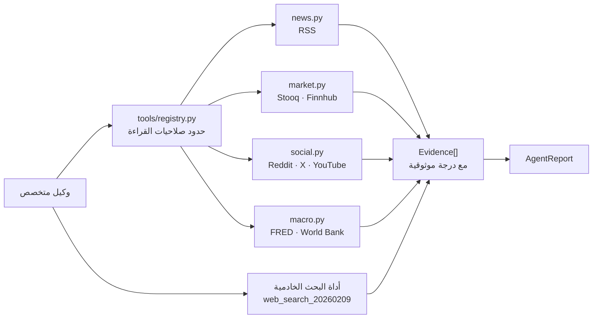

# ٣. التقنيات ومصادر البيانات اللحظية

> المستند الثالث من ثلاثة: **التقنيات البرمجية المقترحة وربط التطبيق
> بمصادر البيانات اللحظية (APIs / Web Scraping / Vector DBs)**.
> الأول: [المعمارية وتدفق البيانات](01-architecture.md).
> الثاني: [برومبتات النظام](02-agents-prompts.md).

---

## ٣.١ ما هو مُنفَّذ فعلاً في هذا المستودع

| الطبقة | التقنية | لماذا هي |
|---|---|---|
| النموذج | `anthropic` (Python SDK) — Claude Opus 5 | تفكير تكيّفي + مخرجات مهيكلة + أداة بحث خادمية |
| الخادم | FastAPI + Uvicorn | async أصيل، وWebSocket بلا طبقة إضافية |
| التزامن | `asyncio` | خمسة وكلاء بالتوازي في وقت وكيل واحد |
| العقود | Pydantic v2 | نفس النماذج تُنتج مخطط JSON للنموذج وتتحقق من رده |
| التخزين | SQLite | صفر تشغيل؛ يُستبدل بـ PostgreSQL بلا تغيير في الواجهات |
| الاسترجاع | SQLite **FTS5** (ترتيب BM25) | ذاكرة عاملة بلا خدمة خارجية |
| HTTP | `httpx` (async) | موصلات بيانات متوازية |
| الواجهة | HTML/CSS/JS خام، RTL | بلا خطوة بناء ولا اعتماديات |
| الاختبار | pytest + pytest-asyncio | 122 اختباراً، منها 24 على محرك التركيب وحده |

### طبقتان للوصول إلى البيانات الحية

**أ) أداة البحث الخادمية من Claude** (`web_search_20260209` في `llm.py`):
تعمل على خوادم Anthropic بلا حلقة تنفيذ عندنا، وتُقيَّد لكل وكيل بنطاقاته
المفضّلة عبر `allowed_domains`، فلا يبحث المحلل الاقتصادي في منتديات
التواصل ولا العكس.

**ب) موصلات مباشرة** (`backend/tools/`): تجلب بيانات مُهيكلة يصعب على
البحث النصي تمثيلها (أسعار، سلاسل اقتصادية، مقاييس تفاعل).



---

## ٣.٢ مصادر البيانات — المُنفَّذ والمقترح

### موصلات تعمل بلا مفاتيح

لكل موصل **مسار أساسي ومسار احتياطي على الأقل**. سقوط مزوّد واحد لم يعد
يُعمي الوكيل، ولا يُعلن المصدر مفقوداً إلا بعد فشل كل مساراته.

| الوكيل | المسار الأساسي | المسار الاحتياطي | القيد |
|---|---|---|---|
| السياسي | RSS (UN، الجزيرة، BBC) | بحث Google News موجّه بالموضوع | عناوين لا تفاصيل |
| الاقتصادي | **FRED عبر `fredgraph.csv`** | واجهة FRED الرسمية عند وجود مفتاح | سلاسل تُراجَع لاحقاً |
| الاقتصادي | RSS (الفيدرالي، ECB، IMF، CNBC) | بحث موجّه | لا تاريخ عميق |
| الاقتصادي | World Bank API | — | سنوي ومتأخر |
| العاجل | RSS (BBC، الجزيرة، AP عبر فهرس) | بحث موجّه | تقارير أولية قابلة للخطأ |
| التاجر | Stooq CSV | **Yahoo Finance JSON** | يومي لا لحظي |
| التاجر | RSS (SEC، CNBC، Yahoo، MarketWatch) | بحث موجّه | — |
| التاجر | Finnhub (بمفتاح) | **خلاصة SEC EDGAR نموذج 4** | البديل غير مُصفّى حسب الرمز |
| بوالعلوم | Reddit JSON | Reddit RSS ← **Hacker News (Algolia)** | عينة منحازة لمنصات محدودة |
| بوالعلوم | YouTube API (بمفتاح) | فهرس عام محدود التغطية | البديل ضعيف التغطية |

**أهم إصلاحين في هذه الطبقة:**

١. **الفيدرالي بلا مفتاح.** كان المحلل الاقتصادي أعمى تماماً دون
`FRED_API_KEY`. مسار `fredgraph.csv` يعطي كل سلسلة بصيغة CSV بلا مفتاح،
فصار المفتاح تحسيناً لا شرطاً للرؤية.

٢. **بحث موجّه بالموضوع.** خلاصات الأقسام تعطي ما هو *رائج* لا ما *طُلب*.
خلاصة بحث Google News تقبل استعلاماً عربياً وتعيد نتائج مطابقة فعلاً،
فتُستدعى تلقائياً حين تقلّ المطابقات عن ثلاث.

> ⚠ **تنبيه صيانة**: `feeds.reuters.com` و`feeds.apnews.com` كانتا في
> النسخة الأولى وهما متوقفتان فعلياً منذ سنوات. استُبدلتا بمسارات عبر فهرس
> Google News. هذا يوضح لماذا `GET /api/sources` ضروري: عناوين الخلاصات
> تموت بصمت، والفحص الدوري هو ما يكشفها.

### موصلات تحتاج مفاتيح (تحسين لا شرط)

| المصدر | المتغير | ما يفتحه | البديل عند غيابه |
|---|---|---|---|
| FRED | `FRED_API_KEY` | استجابة أسرع وحدود أعلى | CSV العام — يعمل |
| X (Twitter) API v2 | `X_BEARER_TOKEN` | منشورات حية بمقاييس تفاعل | لا بديل قانوني |
| YouTube Data API | `YOUTUBE_API_KEY` | اتجاهات المحتوى المرئي | فهرس عام محدود |
| Finnhub | `FINNHUB_API_KEY` | تصفية المطلعين حسب الرمز | EDGAR عام غير مُصفّى |

### كيف يُعالَج الفشل

| الطبقة | الآلية |
|---|---|
| **تصنيف** | `FailureKind`: مفتاح ناقص / محجوب / تعذّر الوصول / لا نتائج / استجابة غير صالحة |
| **إعادة محاولة** | تراجع أسّي مع تشويش، للأعطال العابرة وحدها (مهلة، 429، 5xx) |
| **لا إعادة بلا فائدة** | 401 و403 و404 تُعاد فوراً بلا تكرار |
| **احترام `Retry-After`** | يُقرأ من الترويسة ويُحترم حتى ٥ ثوانٍ |
| **تخزين مؤقت** | ١٨٠ ثانية لكل عنوان، بمفتاح مستقل عن ترتيب المعاملات |
| **عميل مشترك** | تجميع اتصالات بدل عميل جديد لكل طلب |
| **تشخيص** | `GET /api/sources` يفحص كل موصل ويصنّف حالته |

**التمييز الجوهري:** «مفتاح ناقص» ليس عطلاً بل إعداداً يصلحه المستخدم،
و«محجوب» عطل لا يصلحه. لذلك مفتاح ناقص مع بقاء مصادر أخرى حية **لا يرفع
`degraded`** ولا يُسقط سقف الثقة إلى 0.60 — بل يُعلَن كنقص تغطية فقط.

### مقترحات للإنتاج الجاد

| المجال | المصدر | ما يضيفه |
|---|---|---|
| تدفقات مؤسسية | SEC EDGAR (13F/13D، Form 4) | مراكز الصناديق الفعلية |
| عمق السوق | Polygon.io · Databento · Kaiko | صفقات كتلية، دفتر أوامر، بيانات رقمية |
| مشتقات | CBOE · Deribit · CME | الفائدة المكشوفة، تموضع الخيارات |
| أخبار مهيكلة | Reuters/Refinitiv · Bloomberg B-PIPE · Benzinga | عناوين بوسم زمني بالملّي ثانية |
| جيوسياسة | GDELT · ACLED · UN Comtrade | رصد أحداث عالمي منظّم |
| اقتصاد | Trading Economics · Eurostat · OECD | جداول إصدارات وتوقعات الإجماع |
| سلاسل عامة | Arkham · Nansen · Glassnode | تتبع محافظ الحيتان |
| مشاعر مرخّصة | Brandwatch · Talkwalker · Meltwater | تغطية متعددة المنصات قانونياً |

---

## ٣.٣ الكشط (Web Scraping) — موقف واضح

**لا يوجد في هذا المستودع أي كشط يخالف شروط خدمة منصة.** المنفّذ هو:
خلاصات RSS منشورة للاستهلاك الآلي، وواجهات JSON عامة، وواجهات رسمية
بمفاتيح.

إذا احتجت الكشط لاحقاً، فالترتيب الصحيح للمحاولات:

1. **واجهة رسمية** — حتى لو مدفوعة. أرخص من الصيانة والمخاطرة القانونية.
2. **RSS / Atom / Sitemap** — منشور أصلاً للقراءة الآلية.
3. **بوابة بيانات مفتوحة** — data.gov ومثيلاتها.
4. **كشط HTML** — الملاذ الأخير، وبهذه الشروط:

```python
# النمط الموصى به عند الاضطرار للكشط
# 1) احترم robots.txt برمجياً لا بالنية
from urllib.robotparser import RobotFileParser
# 2) معرّف وكيل صادق فيه وسيلة تواصل
# 3) حدّ معدل + تراجع أسّي (aiolimiter / tenacity)
# 4) تخزين مؤقت للصفحات لتقليل الطلبات المكررة
# 5) مراجعة شروط الخدمة قبل كل مصدر جديد
```

أدوات مناسبة عند الحاجة: `httpx` + `selectolax` للصفحات الساكنة،
`Playwright` للمحتوى المُولَّد بجافاسكربت، `trafilatura` لاستخراج المتن،
و`Scrapy` للزحف واسع النطاق.

**تحذير عملي:** المحتوى المكشوط مصدر غير موثّق. لهذا كل `Evidence` في
هذا النظام يحمل `reliability`، وموثوقية المكشوط يجب أن تبدأ منخفضة.

---

## ٣.٤ قواعد البيانات المتجهية (Vector DBs)

### ماذا تخزّن الذاكرة هنا؟

ليس الأخبار الخام — بل **تقارير الوكلاء وقراراتها السابقة**. الفائدة
المباشرة: الوكيل يرى ما قاله قبل أسبوع عن نفس الموضوع، فيلاحظ التناقض
مع نفسه بدل تكراره.

### التنفيذ الحالي: SQLite FTS5

اخترنا البحث النصي (BM25) افتراضياً لسببين: صفر اعتماديات تشغيلية،
وملاءمته لاسترجاع تقارير قصيرة بكلمات مفتاحية واضحة. مع **تطبيع عربي**
في `memory.py`: حذف التشكيل والتطويل، وتوحيد الألف والياء والتاء
المربوطة — بدونه يفشل مطابقة «الفائدة» مع «الفائده».

### الترقية إلى بحث دلالي

`VectorStore` واجهة مجرّدة بثلاث دوال فقط (`upsert` / `search` /
`recent`)، و`QdrantStore` منفّذ في `memory.py` ينتظر خدمة ودالة تضمين:

| الخيار | متى تختاره |
|---|---|
| **Qdrant** | الافتراضي الجيد: فلترة غنية، تشغيل ذاتي أو سحابي |
| **pgvector** | عندك PostgreSQL أصلاً وتريد قاعدة واحدة |
| **Weaviate** | تريد بحثاً هجيناً (متجهي + كلمات) جاهزاً |
| **Milvus** | مليارات المتجهات |
| **LanceDB** | محلي بلا خادم، ملف واحد |
| **Chroma** | نماذج أولية سريعة |

نماذج التضمين: **Voyage** (`voyage-3`) لجودة عالية متعددة اللغات، أو
`multilingual-e5-large` محلياً عبر `sentence-transformers` عند اشتراط
عدم خروج البيانات.

**نصيحة عملية:** البحث الهجين (BM25 + متجهي) يتفوق على أيٍّ منهما وحده
في هذا النوع من المحتوى، لأن أسماء المؤشرات والرموز (CPI، XAUUSD)
تُطابَق حرفياً أفضل، بينما «قلق من ركود» يُطابَق دلالياً أفضل.

---

## ٣.٥ ترقية ناقل الرسائل

`MessageBus` الحالي داخل العملية الواحدة — مناسب لعُقدة واحدة. واجهته
(`publish` / `subscribe` / `collect`) مصممة للاستبدال:

| البديل | متى |
|---|---|
| **Redis Streams** | أبسط قفزة: استمرارية + مجموعات مستهلكين |
| **NATS JetStream** | زمن استجابة منخفض جداً وعناوين هرمية |
| **Kafka** | إعادة تشغيل الأحداث وتدقيق طويل الأمد |
| **RabbitMQ** | توجيه معقّد وضمانات تسليم |

للمهام الطويلة: **Celery** أو **ARQ** أو **Temporal** (الأخير يعطي
استئنافاً بعد الأعطال، وهو ما تحتاجه دورة تحليل تستغرق دقائق).

---

## ٣.٦ ملاحظات تشغيلية على استدعاء النموذج

المطبّق في `backend/llm.py`:

| الممارسة | التطبيق | الفائدة |
|---|---|---|
| تفكير تكيّفي | `thinking={"type": "adaptive"}` | عمق تلقائي حسب صعوبة المهمة |
| مستوى جهد | `output_config.effort` | `high` للمتخصص، `xhigh` للتنسيقي |
| مخرجات مهيكلة | `output_config.format.json_schema` | لا تحليل نصي هشّ لرد النموذج |
| تخزين مؤقت للبرومبت | `cache_control` على برومبت النظام | البرومبتات ثابتة وطويلة ⇒ توفير كبير |
| فصل البحث عن الهيكلة | نداءان لا نداء واحد | تثبيت الأدلة قبل صياغة الادعاء |
| فحص `stop_reason` | قبل قراءة المحتوى | `refusal` و`max_tokens` تُعالَج لا تُتجاهل |
| مخطط صارم | `additionalProperties:false` + كل الحقول مطلوبة | لا حقول ناقصة تتسلل |

**ملاحظة تكلفة:** الدورة الواحدة = 5 وكلاء × (بحث + هيكلة) + تركيب =
11 نداءً. إن أردت خفض التكلفة، الخيار الصحيح هو خفض `effort` للمتخصصين
(عبر `SPECIALIST_EFFORT` في `.env`) قبل تغيير النموذج، وقياس الأثر على
جودة التقارير أولاً.

---

## ٣.٧ خارطة الطريق للإنتاج

| المرحلة | العمل |
|---|---|
| **أمان** | مصادقة على `/api/*` و`/ws`، حدّ معدل، أسرار في خزنة لا في `.env` |
| **حالة** | PostgreSQL + Redis بدل SQLite داخل العملية |
| **موثوقية** | Temporal/ARQ للدورات الطويلة، وقاطع دائرة لكل موصل |
| **رصد** | OpenTelemetry بربط `correlation_id`، وتتبّع تكلفة كل دورة |
| **جودة** | مجموعة تقييم (eval) على قرارات تاريخية: هل تنبّأ المحرك بالتضارب الصحيح؟ |
| **التزام** | إخلاء مسؤولية في الواجهة: هذا نظام دعم قرار لا نصيحة استثمارية |

---

## ٣.٨ تنبيه ختامي

هذا النظام يرفع جودة المعلومة ويكشف تضاربها ويعلن حدودها. لا يتنبأ
بالأسواق. التوصية فيه مشروطة بشروط إبطال معلنة، والقرار النهائي — كما
نُصّ عليه في كل برومبت — للمستخدم وحده.
